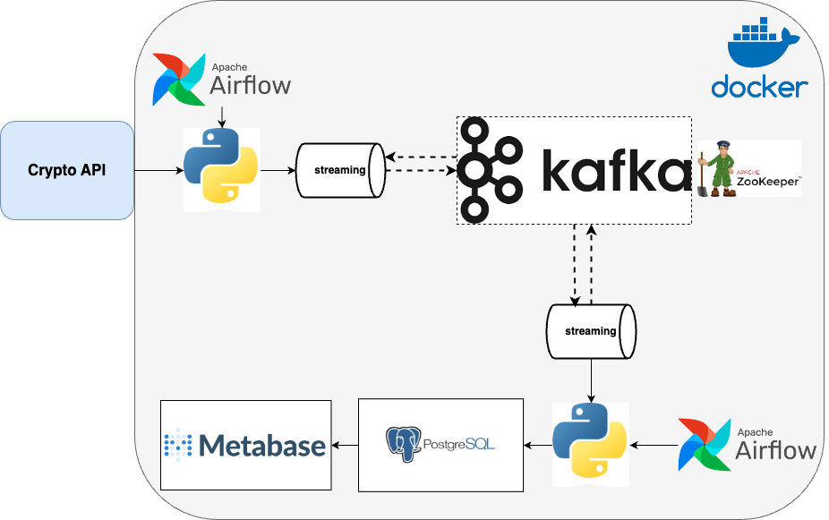

# Crypto Data Streaming Project
## Introduction:
This project is designed to demonstrate a complete data streaming pipeline that captures real-time cryptocurrency data (Bitcoin) from an external API, processes it using Apache Airflow, streams it through Apache Kafka, and stores it in a PostgreSQL database. The stored data is then visualized using Metabase. The entire pipeline is containerized using Docker for easy deployment and scalability.

## Architecture overview:

The architecture consists of the following components:

- **Crypto API**: The source of real-time cryptocurrency data.
- **Apache Airflow**: Orchestrates the workflow to fetch data from the API and stream it into Kafka.
- **Python Scripts**: Handle data processing and streaming tasks.
- **Apache Kafka**: Serves as the message broker to stream data between components.
- **Apache ZooKeeper**: Manages Kafka brokers.
- **PostgreSQL**: Stores the processed cryptocurrency data.
- **Metabase**: Provides data visualization and analytics capabilities.
- **Docker**: Containerizes all the components for easy deployment and management.

